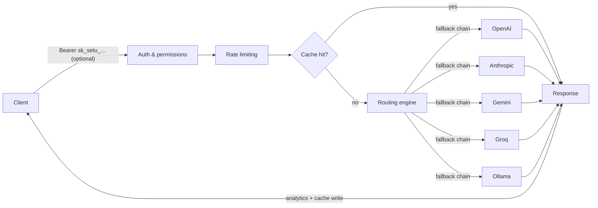

<p align="center">
  <picture>
    <source media="(prefers-color-scheme: dark)" srcset="logo/dark.svg">
    <source media="(prefers-color-scheme: light)" srcset="logo/light.svg">
    
  </picture>
</p>

<p align="center">
  <b>Setu</b> (सेतु) means "bridge." Setu Gateway is the bridge between your applications and every LLM provider.
</p>

<p align="center">
  <a href="https://github.com/setu-gateway/nexus-gateway/actions/workflows/ci.yml"></a>
  <a href="LICENSE"></a>
  <a href="CONTRIBUTING.md"></a>
  <a href="rfcs/"></a>
</p>

---

## What is Setu Gateway?

Setu Gateway is an open-source, self-hostable **AI gateway**: a single OpenAI-compatible API in front of every LLM provider you use — OpenAI, Anthropic, Google Gemini, Groq, and locally-run Ollama models.

## Why use it?

Point your existing OpenAI SDK at Setu instead of directly at a provider, and get:

- 🔀 **Intelligent routing** — capability-aware model selection, health-aware fallback chains across providers, and org-level routing rules, with an explainable routing decision on every request.
- 🔌 **One API, every provider** — chat completions, embeddings, and streaming behind the OpenAI-compatible surface your existing SDKs already speak.
- 🗄️ **Tiered caching** — memory → Redis → Postgres response cache, with per-project policy control.
- ⏱️ **Time Machine** — record a request/response pair and replay it later against the same model or a different one, to catch drift or compare providers.
- 🔑 **Scoped API keys** — keys restricted to specific providers, models, and permissions, with IP allowlisting and per-key rate limits.
- 🚦 **Rate limiting** — token bucket, sliding window, and fixed window algorithms, configurable per organization, project, or key.
- 🪝 **Webhooks** — HMAC-signed, retried notifications for request completion, key lifecycle, and quota events.
- 📊 **Usage analytics** — per-provider and per-model breakdowns of volume, latency, error rate, and estimated cost.
- 🧪 **An evaluation engine** — pluggable scorers (exact match, contains, structured output, tool calls), run against any model, with pass-rate history over time.
- 🐍📦 **Official SDKs and a CLI** — Python, TypeScript, and `setu` for diagnostics, benchmarking, and replaying requests from the terminal.

> **Status:** Setu Gateway is pre-release and under active development (see [ROADMAP.md](ROADMAP.md)). The core request path — auth, routing, caching, rate limiting, analytics — is real and tested. It's a good fit for self-hosting and evaluation today; some rough edges are documented candidly in [Troubleshooting](support/troubleshooting.mdx), including that dashboard-management endpoints (organizations, keys, routing rules) don't yet enforce authentication. APIs and schemas may still change before v1.

## How it works



See [Routing](features/routing.mdx) for how a provider gets picked and what happens on failure.

## Quickstart

The fastest way to run Setu Gateway locally is Docker Compose:

```bash
git clone https://github.com/setu-gateway/nexus-gateway.git
cd nexus-gateway
cp .env.example .env
docker compose up -d
```

This starts the gateway, dashboard, PostgreSQL, and Redis. The gateway listens on `http://localhost:8000`. `docker-compose.override.yml` is picked up automatically and live-reloads the gateway on changes under `apps/gateway`, `packages`, or `plugins` - no rebuild needed while you're editing.

Send your first request — it's OpenAI-compatible, so existing SDKs work unchanged. No API key needed to try it (see [Authentication](api/authentication.mdx) for why, and how to create a scoped one):

```bash
curl http://localhost:8000/v1/chat/completions \
  -H "Content-Type: application/json" \
  -d '{
        "model": "gpt-4o",
        "messages": [{"role": "user", "content": "Hello, Setu!"}]
      }'
```

No provider API keys configured yet? You'll get a clearly-labeled mock response instead of an error — set `OPENAI_API_KEY` (or `ANTHROPIC_API_KEY` / `GEMINI_API_KEY` / `GROQ_API_KEY`) in `.env` and restart for real completions. See the [full quickstart](getting-started/quickstart.mdx) for streaming, embeddings, and creating a scoped key. Prefer running from source? See the [installation guide](getting-started/installation.mdx).

## How it's built

Setu is a monorepo (see [RFC-0001](rfcs/RFC-0001.md)):

| Path | What lives there |
| --- | --- |
| [`apps/gateway`](apps/gateway) | The Python/FastAPI gateway — routing, auth, providers, plugins, database models. Also serves a built-in playground UI at `/playground`. |
| [`apps/dashboard`](apps/dashboard) | Web dashboard for metrics, routing config, and API key management |
| [`apps/docs`](apps/docs) | This documentation site (Mintlify) |
| [`packages/`](packages) | Python & TypeScript SDKs, the plugin SDK, and the CLI |
| [`plugins/`](plugins) | Provider adapters (OpenAI, Anthropic, Gemini, Groq, Ollama) and the plugin lifecycle interface |
| [`infrastructure/`](infrastructure) | Docker Compose, Kubernetes manifests |
| [`rfcs/`](rfcs) | Every accepted architectural decision behind this project |
| [`tests/`](tests) | Unit and integration tests (400+, run against real PostgreSQL semantics) |

The backend is Python 3.10+, FastAPI, SQLAlchemy 2, PostgreSQL, and Redis. The dashboard is React, TypeScript, and Tailwind. See [RFC-0002](rfcs/RFC-0002.md) for the original system architecture proposal.

## Documentation

- **New to Setu?** Start with [Introduction](getting-started/introduction.mdx) → [Installation](getting-started/installation.mdx) → [Quickstart](getting-started/quickstart.mdx).
- **Configuring providers?** See [`providers/`](providers) for OpenAI, Anthropic, Gemini, Groq, and Ollama setup.
- **Deploying?** [Docker](deployment/docker.mdx), [Kubernetes](deployment/kubernetes.mdx), [Configuration reference](deployment/configuration.mdx).
- **Using a specific feature?** [Routing](features/routing.mdx) · [Caching](features/caching.mdx) · [Time Machine](features/time-machine.mdx) · [Webhooks](features/webhooks.mdx) · [Rate Limiting](features/rate-limiting.mdx) · [Analytics](features/analytics.mdx).
- **Integrating?** [Python SDK](sdk/python.mdx) · [TypeScript SDK](sdk/typescript.mdx) · [CLI](cli/commands.mdx) · [API reference](api/chat.mdx) · [runnable examples](examples/).
- **Writing a plugin?** See [Plugin overview](plugins/overview.mdx) and [Creating plugins](plugins/creating-plugins.mdx).
- **Something not working as expected?** [Troubleshooting](support/troubleshooting.mdx) and the [FAQ](support/faq.mdx) cover known gaps and gotchas candidly.
- **Curious about a design decision?** Every major decision is an [RFC](rfcs) — start with [RFC-0000: Engineering Principles](rfcs/RFC-0000.md).
- **Benchmarks?** See [PERFORMANCE.md](PERFORMANCE.md) for load-test results and the tuning they motivated.

## Contributing

Setu Gateway is built in the open, and contributions are welcome — bug fixes, new providers, plugins, tests, and documentation all count.

1. Read [CONTRIBUTING.md](CONTRIBUTING.md) and the relevant [RFC](rfcs).
2. Check open [issues](https://github.com/setu-gateway/nexus-gateway/issues), especially ones labeled `good first issue`.
3. Open a pull request from a short-lived branch off `main` using [Conventional Commits](https://www.conventionalcommits.org/).

Please also read our [Code of Conduct](CODE_OF_CONDUCT.md). Found a security issue? Do not open a public issue — see [SECURITY.md](SECURITY.md) for responsible disclosure.

## License

[Apache 2.0](LICENSE) © Setu Gateway Contributors
